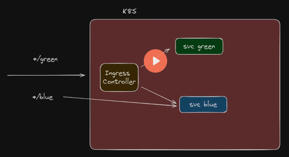

# nginx-ingress-contoller
Implementação local de um nginx ingress controller



## Criação do cluster local

```bash
kind create cluster --name meucluster --config kind-config.yaml
```

## Instalação do Ingress Controller

https://kubernetes.github.io/ingress-nginx/deploy/#bare-metal-clusters

```bash
wget https://raw.githubusercontent.com/kubernetes/ingress-nginx/controller-v1.13.0/deploy/static/provider/baremetal/deploy.yaml

```

Ajustar para usar porta 30000

## Execução

```bash
kubectl apply -f deploy-ingress.yaml
kubectl get all -n ingress-nginx
```

Utilizar https://nip.io/ para resolução de dominios nos testes

```bash
kubectl apply -f deploy.yaml
kubectl apply -f ingress.yaml
```